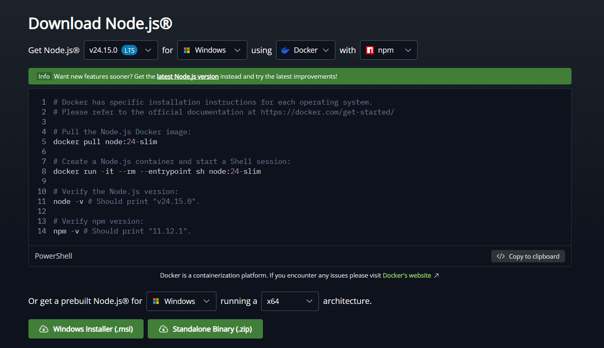

# MusicBox-YTMusic
A lightweight Electron app for YouTube Music with quality-of-life enhancements.

## Features
+ **Native Feel:** A dedicated app for your music, just like how other streaming apps do it.
+ **Discord Rich Presence:** Your friends will know everything you listen to. Can be turned off.
+ **QoL Fixes:** Logarithmic volume curve, easier on your ears, simpler to adjust.
+ **Cross-Platform:** Supports Windows and Linux.

*Tested on Windows 10/11 64-bit and Linux Debian-based*

## Installation
### 1. Clone the repo
Terminal / PowerShell

`git clone https://github.com/FortHell/MusicBox-YTMusic.git`

OR [Direct Download](https://github.com/FortHell/MusicBox-YTMusic/archive/refs/heads/main.zip), then unzip

### 2. Install Node.js
Go on this page: https://nodejs.org/en/download

If you're on Windows, select "Windows Installer (.msi)".
This will also install npm, which you'll need.

### 3. Setup
After **inside the project's folder**, run `npm i` to install the required libraries.
You can now start working on the project.

Running the app: `npm run start`

Creating an installer: `npm run build`
